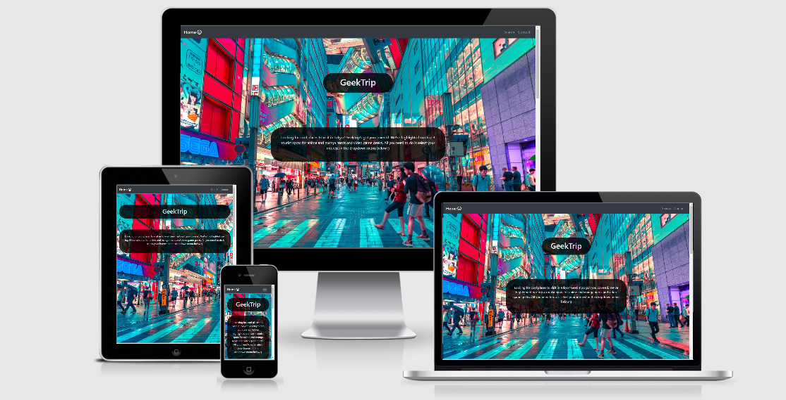
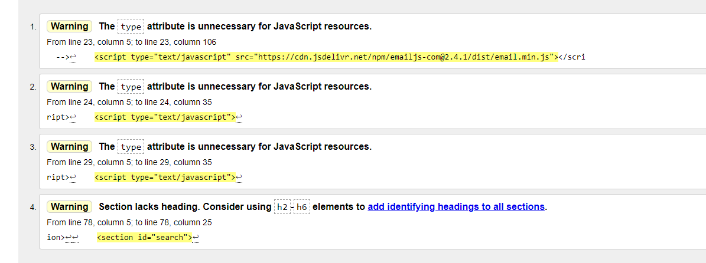

# GeekTrip

Milestone 2 Project: Interactive Frontend Development - Code Institute

For my second milestone project, I choose to create a site in that would show the top 4 tourist spots in Tokyo, Japan, depending on whether the user was interested in anime and manga, or video games.  

## Demo 
 A live demo can be found [here](https://kel151.github.io/milestone2/)
 
 Here is the responsiveness preview:
 

## UX
### User Stories
As someone who enjoys travel, I want to be able to find interesting locations to visit in Tokyo, Japan.

As a fan of anime and manda, I want to know where in Japan to go to cater to my interest.

As a fan of video games, I want to be able to find locations that pertain to video games.

As someone who enjoys aesthetics, I want to view a sight that is both pleasing to the eye and on brand for the theme of "geeks" and "nerds".

### Strategy
Tokyo is large city, known for many things such as food, fashion, technology, culture, etc. Through this milestone, I wanted to facilitate more specific interests and tailor the search for tourist spots to somewhat niche subjects. Therefore, my goal was to build a website that allowed the user to easily and swiftly find tourist pots in Tokyo, Japan, related to video games or anime and manga.

  I wanted to keep the site quite basic, hence the choice of 3 sections, so as not to detract from purpose and design. The utilization of 3 sections helps to build narrative of the site and its purpose in the user's mind, and I feel that greatly aids in yielding more potent user story.

### Scope
The purpose of this project was built a wesite that would show the suer the top 4 tourist spots in Tokyo, Japan, depending on whether they were interested in anime and manga or video games.

 This project was also an opportunity for me to display my skill in HTML, CSS, and JS, as well as showcase a my comptentence with the utilisation of APIs, particularly the Google Maps API and the one from [EmailJS](https://www.emailjs.com/).

 
### Surface
Given that the project is centered upon Tokyo, and its prevailing themes are anime, manga, and video games, I wanted an aesthetic that would remain "on brand". Tokyo, particularly its gaming and tech scene, is known for its neons and flashing lights. I wanted to incoprate that element into the site's design while preventing them from being too overpowering. Therefore, I opted for carefuly curated, theme-related images as background for the first and lst pages, separated by a respectable portion of black space on the second page, to break up the wall of colour and prevent the aeshetic from being too jarring.

 
### Skeleton
 <ul>
    <li>Landing Page (which contains the about info for more efficient use of screen space)</li>
    <li>Search Mape</li>
    <li>Contact</li>
</ul>

### Structure
[Here](wireframes) are a list of the wireframes I developed for this project using [Balsamiq](https://balsamiq.com/).

### Features
<ul>
  <li>I opted to use a single page format to make navigation much simpler and intuitive, meaning the user doesn't need to click back and forth between pages.</li>
  <li>The default setting for the navbar seemed to create a very stark and jarring transition to whatever you clicked on. It wasn't a very smooth effect. So, I opted for a smooth scrolling effect instead of just appearing on whatever navbar item you click on, and this made for a much nicer, more fluid experience.</li>
  <li>I used marker clustering with the map markers to make it easier to view and interact with markers that were placed very clsoe together.</li>
 <li>I created the footer to mirror the navbar in design, being black. This made for a very balanced and symmetrical visual experience when both were present and visible on the screen.</li>
 <li>I included social media links in the footer and added a small rotation and colour changing animation to help enhance their visibility and presence.</li>
</ul>

### Features left to implement
<ul>
  <li>I attempted to add a form validator to ensure no blank fields could be submitted in contact form, and I also attempt to create a fucntion that would clear the form upon submission for better UX. However, they didn't seem to work for me. In the future, I'd like to work on that a bit more and implement those features</li>
  <li>I would like to include button interaction to the contact form button so that it does somethign or changes somehow when pressed so that the user can be sure they pressed the button. This would be better from a UI/UX perspective, and I hope to implement that in the future.</li>
  <li>I would like to create a fucntion that creates a prompt upon submission to inform the user that their submission was successful. 

## Technologies Used
<ul>
    <li><a href="https://code.visualstudio.com/">Visual Code Studio</a> - code editor used for this project.
</li>
    <li><a href="https://en.wikipedia.org/wiki/HTML">HTML</a> - to create the structure of the project and define the "skeleton", so to     speak.
</li>
    <li><a href="https://en.wikipedia.org/wiki/Cascading_Style_Sheets">CSS</a> - to design and style the project, adding the "flesh to       the skeleton", so to speak
</li>
    <li><a href="https://getbootstrap.com/">Bootstrap</a> - used as a framework to make design faster and easier.
</li>
    <li><a href="https://git-scm.com/">Git</a> - used for version control.
</li>
    <li><a href="https://fontawesome.com/">Font Awesome</a> - used for social media icons.
</li>
    <li><a href="https://htmlformatter.com//">HTML Formatter</a> - used to beautify html.
</li>
    <li><a href="https://www.cleancss.com/css-beautify/">CSS Formatter</a> - used to beautify css.
</li>
    <li><a href="http://ami.responsivedesign.is/">Am I Responsive?</a> - used to test responsiveness.
</li>
    <li><a href="https://www.javascript.com/">JavaScript</a> - used with Bootstrap.
</li>
    <li><a href="https://jquery.com/">JQuery</a> - used to support Java Script.
</li>
</ul>
  
### Additional resources and tools
<ul>
  <li><a href="https://www.w3schools.com/">W3 Schools</a>
</li>
  <li><a href="https://stackoverflow.com/">Stack Overflow</a>
</li>
  <li><a href="https://css-tricks.com/">CSS-Tricks</a>
</li></li>
  <li><a href="https://github.com/">GitHub</a>
</li>
  <li><a href="https://www.youtube.com/">Youtube</a> - used for various tutorials. I find that I am a visual learner i.e. I learn better by watching others do, so I used YouTube tutorials for help pertaining to certain things I find tricky, such as the <a href="https://www.youtube.com/watch?v=23bpce-5s8I">nav bar</a> and the <a href="https://www.youtube.com/watch?v=woVuUbDOeMk&t=5s)">social media links</a>
</li> 
</ul>

## Testing
The first step of my testing began by using <a href="http://ami.responsivedesign.is/">Am I Responsive?</a> to deduce whether my project was indeed responsive and compatible across all devices, the results of which can be observed at the beginning of this readme in the responsiveness preview.

The second stage involved sharing the deployed link with a few colleagues and friends to double check whether it was actually responsive or not.

The third step of my testing involved passing my JavaScipt code through [Jshint](https://jshint.com/), and I had no major issues.

The fourth step of my testing involved the utilization of [Code Verifier](https://validator.w3.org/), the result of which had no errors, but 4 warnings as seen here:

It is worth noting that 3 of the 4 warnings are from code provided by  the [EmailJS doc on how to create their contact forms.](https://www.emailjs.com/docs/tutorial/creating-contact-form/)

## Deployment
This site is hosted on GitHub pages and it's deployed directly using the master branch. The deployed site will update automatically when new commits are made and then pushed from VSCode. To deploy the site correctly, the landing page must be named 'index.html'.

To run locally, you can clone this repository directly into the editor of your choice by pasting git clone https://github.com/kel151/milestone2.git into your terminal. To cut ties with this GitHub repository, type git remote rm origin into the terminal.

## Credit
### Content
All of text in the "About" section was written by me.

### Media
The images used in this project were taken from <a href="https://unsplash.com//">Unsplash</a>, an open license and highly customizable resource that I greatly recommend. 

## Acknowledgements
<ul>
 <li>My mentor, Aaron Sinnot, for all of his patience, advice, and recommendations.</li>
 <li>My friend and fellow member of the Code Institute Slack Community, Mia, for all of her advice, kindness, and encouragement.</li>
 <li>The Student Care team, particularly Claire Lally, for the constant support, encouragement, and check-in messages.</li>
 <li>The Code Insitute tutpring team (particularly Michael, Samantha, Scott, Xavier, and Tim) for their patience perpetual willingness to help, no matter how late.</li>
</ul>

<strong>This is for educational use.</strong>
